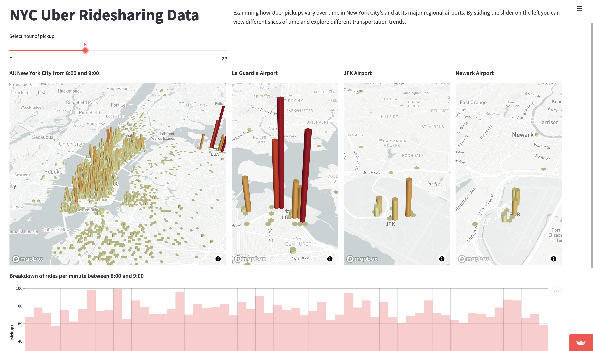

# Streamlit 

[Streamlit](https://streamlit.io) turns data scripts into shareable web apps in minutes. All in pure Python. No front‑end experience required.


A [Streamlit demo](https://streamlit.io/gallery) to interactively visualize Uber pickups in New York City:




## Clone Repo (use this template)

- In this GitHub repo, click on "Use this Template" (the green button at the top of this page)

- In your GitHub-Account, download the `streamlit-app` repository to your machine with GitHub Desktop

- In your terminal (Mac) or Anaconda Command Prompt (Windows), cd into the `streamlit-app` folder

```bash
cd streamlit-app
```

- Now we install all needed Python libraries from the `environment.yml` file to create a virtual environment named `streamlit`:

```bash
conda env create -f environment.yml
```

- Activate the `streamlit` environment:

```bash
conda activate streamlit
```

- cd into 1-first-app

```bash
cd 1-first-app
```

- Start the app:

```bash
streamlit run app.py
```

- While developing a Streamlit app, it's recommended to lay out your editor and browser windows side by side, so the code and the app can be seen at the same time. 

- Complete the code with the help of this [Cheat Sheet](https://docs.streamlit.io/library/cheatsheet).

- If you are done, go to your terminal and stop your app with `Ctrl+C`


## Guides

- Get familiar with the [main concepts](https://docs.streamlit.io/library/get-started/main-concepts)
 
- [API reference](https://docs.streamlit.io/library/api-reference)

- [Cheat Sheet](https://docs.streamlit.io/library/cheatsheet)

- [Layout](https://blog.streamlit.io/designing-streamlit-apps-for-the-user-part-ii/?utm_medium=email&_hsmi=200036447&_hsenc=p2ANqtz-_qSKsHsARDBJ3IdOcp5kzxhvmFIn4KBaC9-mLf2Gbu0PpToQUqZpdDlv7AWxrx0fiObeilulYthAZqC7QIdHBLTphUBg&utm_content=200036447&utm_source=hs_automation)

- App demo:

```bash
streamlit hello
```
